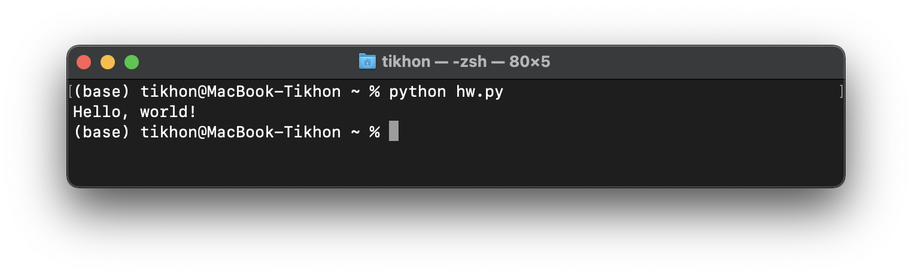

# Курс по Python

Итак, википедия говорит, что

> Python — высокоуровневый язык программирования общего назначения с динамической строгой типизацией и автоматическим управлением памятью, ориентированный на повышение производительности разработчика, читаемости кода и его качества, а также на обеспечение переносимости написанных на нём программ.

Язык Python интерпретируемый, то есть существует специальная программа, которая выполняет все инструкции которые мы напишем, например, если ему дать такую простейшую программу:

```python
print("Hello, world!")
```

В окне вывода информации или консоли появится текст `Hello, world!`:



Над тем, чтобы преобразовать команду `print("Hello, world!")` в текст `Hello, world!` поработал интерпретатор Python. 

# Установка интерпритатора Python

Скачайте с официального сайта установщик и установите: [https://www.python.org/downloads/](https://www.python.org/downloads/) 

Не забудьте поставить галочку `установить pip` это очень пригодится на следующем этапе

Проверьте, установку: откройте командную строку и введите:

```bash
$ python -V
Python 3.8.10
$ pip -V
pip 21.2.4
```

Если на экране не отобразилась версия, значит что-то пошло не так. Проверьте установку. 

# Установка Jupyter Notebook

Для работы нам пригодится удобная среда для разработки и обучения [JupyterLab](https://jupyter.org/). 

Чтобы ее установить, откройте командную строку и введите:

```bash
$ pip install jupyterlab
```

Когда процесс установки будет закончен, вы сможете запустить среду командой:

```bash
$ jupyter notebook
```

Откроется окно браузера, где можно открыть или создать файлы со специальными python-тетрадками. 

Мы уже подготовили для вас [одну](lab_1.ipynb) (`lab_1.ipynb`), скачайте ее и откройте...

---

© Tikhon Petrishchev 2020