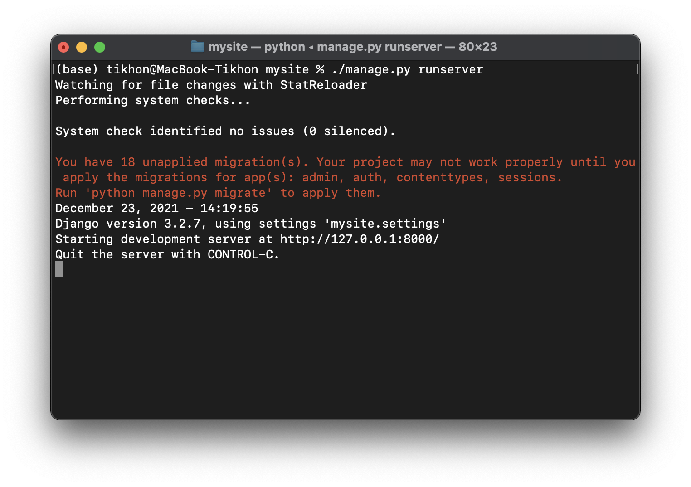
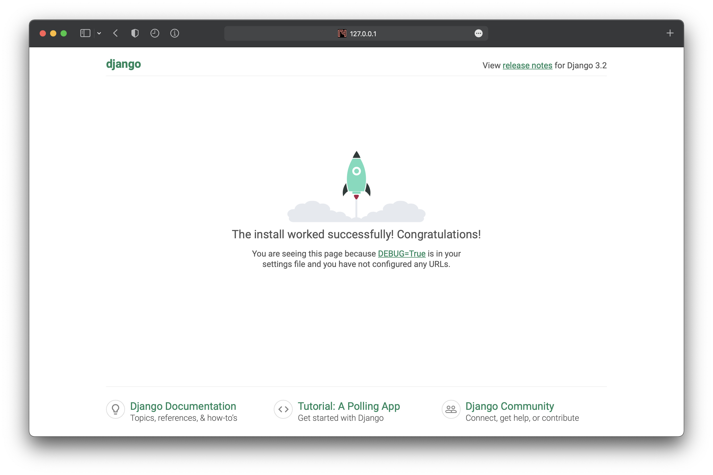
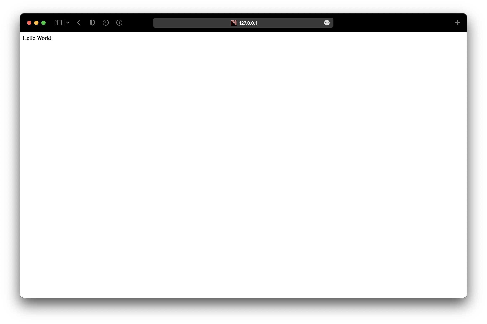
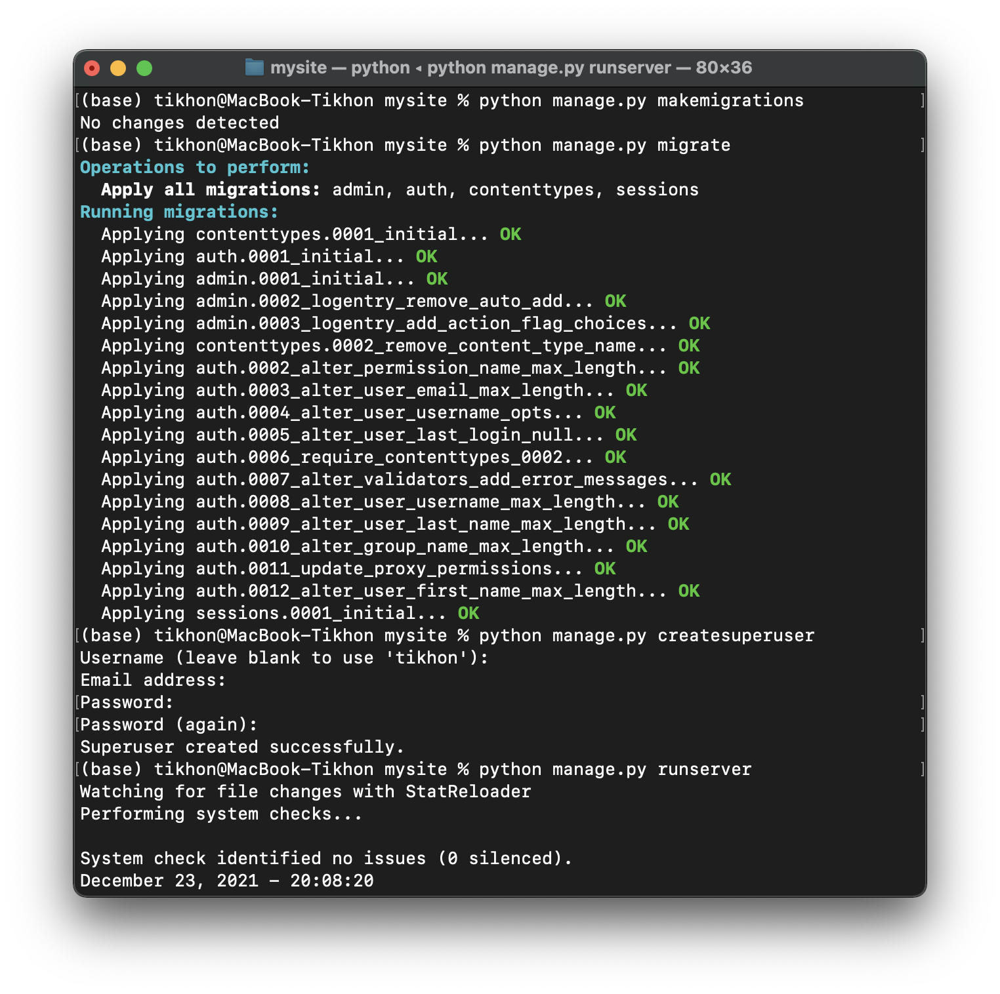

# Начало работы с Django

Django - мощный и быстрый фреймворк для разработки бекенда. Он устроен модульным путем с подклюсемыми приложениями.

Для более глубокого понимания прочитайте [официальный Startup guide](https://docs.djangoproject.com/en/4.0/intro/tutorial01/).

Установить django можно через pip:


```bash
pip install Django
```

Последняя версия Django `4.0`, проверьте версию командой:


```bash
python -m django --version
```

Создаим новый проект `Django`:


```bash
django-admin startproject mysite
```

Django cоздал папку с проектом, однако это только каркас сайта, за разные его части отвечают отдельные модули или приложения, которые нам надо создать. Сначала проверим работу джанго, запустим тестовый сервер:


```bash
cd mysite
ls
python manage.py runserver
```

Если все получилось запустится тестовый сервер:



> Не бойтесь красных предупреждений, они нам не помешают. Работать с ними вы научитесь позже

Теперь откроем страницу сайта по адресу: `http://127.0.0.1:8000/`:



Итак все заработало, создадим приложение с которым будем работать:


```bash
django-admin startapp main
```


В Django есть файл настроек, чтобы наше приложение работалло корректно добавьте его в `INSTALLED_APPS`. Итак, в файле `mysite/settings.py` добавите в список `INSTALLED_APPS` наше приложение - `'main'`:

```python
INSTALLED_APPS = [
    'django.contrib.admin',
    'django.contrib.auth',
    ...
    
    'main',
]
```

Теперь мы готовы начать строить сайт!

В  файле `views.py` находится слой "view", т. к. `Django` реализует архитектурный подход "MVC" (Model-View-Controller). Этот интерфейс управляет отображением полученных и обработанных данных или проще: генерирует html-ки (На самом деле кроме `html` здесь может генерироваться еще куча всего: Json дата от сервер, бинарные файлы и т д, все что отдается пользователю). Ещё одной важной задачей, которую выполняет слой "view" является обработка ввода от пользователя, например обрабока "POST" запроса с формой, еще можно принимать json данные, файлы и т д. 

Итак, чтобы отдать юзеру html-ку нам нужно использовать `main/views.py` однако как `Django` поймет какую именно? Для этого в django существует слой "urls". Когда `Django` получает запрос, перевым делом фреймворк смотрит по какому `url` он был сделан, скажем например `/hello/world/`. 

Первым делом `Django` ищет совпадения в файле `mysite/urls.py` в корне проекта. А там он видит такой код:

```python
from django.contrib import admin
from django.urls import include, path

urlpatterns = [
    path('admin/', admin.site.urls),
    path('hello/', include('main.urls')),
]
```

Переберая список `urlpatterns` Django ищет подходящий url, `admin/` - неподходит, а после этого идет строчка, которая говорит о том, что для любых url-ов, начинающихся c `hello/` надо бы посмотреть в файл `urls.py`, который лежит в папке `main`, то есть в нашем новом приложении. 

Для того, чтобы это сработало, надо создать файл `urls.py` в папке `main` и положить туда этот код:

```python
from django.urls import path
from main import views

urlpatterns = [
    path('world/', views.hello_world, name="hello-world"),
]
```

Как вы уже догадались, django увидит `contacts/`, сложит 2 + 2 (`hello/` + `world/` = `hello/world/`), ага! Это то что было нужно! А вот и функция которая скажет, что сделать с этим запросом: `views.hello_world`. 

Итак, чтобы понять что надо вернуть пользователю, django смотрит в файл `main/views.py` на функцию `contacts()`, а мы предусмотрительно написали там такой код:

```python
from django.http import HttpResponse


def hello_world(request):
    return HttpResponse("Hello World!")
```

Теперь, продейлайте все эти действия в вашем проекте. 

> Посмотрите файле `mysite/urls.py` в корне проекта, Django большим многострочным комментарием заботливо поместил инструкцию по использованию urls. 

Итак, должно получиться это:



> Обратите внимание, что после кождого изменения в файлах проекта, Django перезагружает тестовый сервер, так что можно сразу приступать к тестированию написанного кода!

# Задание 1

Добавьте вывод текста  "hello world!" и для стартовой страницы, как вы уже догадались для этого нужно прописать еще одну функцию во views, а url будет иметь значение пустой строки. 

---

Это все круто, но как же отдавать html-ку?! 

В django реализован мощный механизм шаблонизатора [Jinja2](https://pypi.org/project/Jinja2/), он уже встроен в Django, нам ничего делать не нужно. Но как им воспользоваться?

Чтобы не путаться в куче разного кода html-ки хранятся в отдельных файлах. Создадим папку `templates/` внутри приложения `main/` (то есть в папке `main/`). Создадим файл `hello_world.html` внутри этой папки и поместим туда этот код:

```html
<!doctype html>
<html lang="ru">
<head>
    <meta charset="UTF-8">
    <title>Hello, world!</title>
</head>

<body>
    <h1>Hello, world!</h1>
</body>
</html>
```

Итак, теперь вместо обычной строки, нам нужно вернуть html-ку. Доработаем нашу функцию, `main/views.py`:

```python
from django.shortcuts import render


def hello_world(request):
    return render(request, 'hello_world.html')
```

Вот так просто!

##### Но так мы же просто отдаем статичную html страничку, как поместить туда какие-то данные?

А как раз здесь в дело вступает `Jinja2`. Предположим мы хотим передать в html содержание переменной hohoho:

```python
def hello_world(request):
    hohoho = 'hohoho'
    return render(request, 'hello_world.html', {
        'hohoho_for_html': hohoho  #  в этом словаре передаются данные для рендерига html
    })
```

А теперь отобразим ее в `html`:

```html
<!doctype html>
<html lang="ru">
<head>
    <meta charset="UTF-8">
    <title>Hello, world!</title>
</head>

<body>
    <h1>Hello, world!</h1>
    <p>{{ hohoho_for_html }}</p>
</body>
</html>
```

Перезагрузите страницу и увдите появившийся текст, можете попробовать изменить тект внутри функции и он изменится в браузере. 

Как вы уже поняли чтобы отобразить данные переданные в словаре, достаточно в лбом месте html-файла написать ключ словаря этих данных внутри двойных фигурных скобок, вот так `{{ varible_name }}`. Внутри html-ки так можно не только отображать переменные, еще брать их свойства применять фильтры, и даже итерироваться по списку, обязательно ознакомьтесь с [офицальным руководством по шаблонам в Django](https://docs.djangoproject.com/en/4.0/topics/templates/), оно пригодится при выполнении заданий. 

# Задание 2

Добавьте html код к главной странице, созданной вами ранее, Пусть там будет поле куда выводится случайное число.

---

Ура! Мы научились отдавать пользователю полезную информацию и ренедерить страницу, но как на счет ввода?

Сейчас, я вам покажу одну из многих мощнейших фич Django - `django.forms`! Django сделает всю грязную работу за нас: генерацию формы, валидацию, отображение ошибок, сбор данных, нам остается лишь указать что именно мы хотим получить. 

Итак, чтобы описать форму нужно создать файл `main/forms.py` в нашем приложении.

Давайте просить у пользователя ввести имя и фамилию, значит нам нужно два текстовых поля, опишем форму в файле `main/forms.py`:

```python
from django import forms


class FirstLastNameForm(forms.Form):
    first_name = forms.CharField(label='Ваше имя', required=True)
    last_name = forms.CharField(label='Ваша фамилия', required=False)
```

Итак, мы описали форму с помощью класса унаследованного от `django.forms.Form` и добавили два текстовых поля (`django.forms.CharField`), аргумент  `required` отвечает за обязательность заполнения поля, если пользователь не заполнит поле в котором `required=True`, то он получит ошибку с объяснением, что поле нужно заполнить. 

Чтобы использовать эту форму, нам нужно обработать запрос пользователя в функции во "view". Возьмем нашу многострадальную `hello_world()`:

```python
from django.http import HttpResponse
from django.shortcuts import render

from main.forms import FirstLastNameForm


def hello_world(request):
    # если это запрос POST мы должны обработать данные формы
    if request.method == 'POST':
        # cоздаем объект класса нашей формы и хаполняем ее данными из запроса пользователя:
        form = FirstLastNameForm(request.POST)
        # проверяем, верно ли заполнена форма:
        if form.is_valid():
            # здесь мы что-то делаем с полученными данными
            first_name = form.cleaned_data['first_name']
            last_name = form.cleaned_data['last_name']
            
            # и возвращаем ответ пользователю (вернем то, что он ввел):
            return HttpResponse(f"Форма заполнена верно: {first_name}, {last_name}")

    # если запрос GET (ну или любой другой), то генерируем пустые поля формы
    else:
        form = FirstLastNameForm()

    return render(request, 'hello_world.html', {'form': form})
```

Теперь, нужно доработать html-ку для отображения формы, открываем `main/templates/hello_world.html`:

```html
<!doctype html>
<html lang="ru">
<head>
    <meta charset="UTF-8">
    <title>Hello, world!</title>
</head>

<body>
    <h1>Hello, world!</h1>
    
    <form action="." method="post">
        
        {{ form }}
        <input type="submit" value="Submit">
    </form>
</body>
</html>
```

Как вы видите, все что нам нужно было сделать добавить переменную `{{ form }}`, а все необходимые поля с формой django сгенерирует сам! Ах, да, в любую форму нужно добавлять ``, этой командой django создаст скрытое поле, информация в котором позволит защитить от хакеров притворяющихся другими людьми в своих запросах. Б - безопасность.

Пробуем!

Формы очень мощьный инструмент, то что вы сейчас попробовали, маленькая макушка вершины айсберга, узнать как работать с ними можно опять же, в [официальном руководстве](https://docs.djangoproject.com/en/4.0/topics/forms/).

# Задание 3

Создайте на отдельной странице форму калькулятор, в которой будет 3 поля, первое число, действие и второе число. Возвращайте пользователю ответ. Используйте класс калькулятор из предидущей лабы.

---

Вот это было круто! Но сейчас я вам покажу что-то еще более крутое! В Django есть встроенная модель пользователей, тему создания моделей в базе данных и работы с ними оставим для следующей лабы. Работа с пользователями в Django реализована настолько просто, что даже этого знать не нужно.

Единственное перед началом работы нужно выполнить две комманды в терминале, сначала остановите тестовый сервер (`ctrl+c`):

```bash
python manage.py makemigrations
python manage.py migrate
```

Их значение мы рассмотрим, когда будем работать с базами данных, сейчас же просто выполните.

Давайте создадим одного пользователя для теста.

```bash
python manage.py createsuperuser
```

Введите все что попросят, ну и запускаем тестовый сервер (`python manage.py runserver`):



Теперь мы готовы начинать!

Итак, давайте создадим новую страницу `/login`, это вы уже умеете, в которой пока ничего не будет:

```python
def login(request):
    return HttpResponse("Ничего")
```

Теперь создадим навую форму для ввода логина и пароля в `main/forms.py`:

```python
class LoginForm(forms.Form):
    username = forms.CharField(label='Имя пользователя', required=True)
    password = password = forms.CharField(
        label='Пароль', widget=forms.PasswordInput(), required=True
    )
```

А теперь самое интересное, напишим логику работы аутентификации пользователя: 

```python
from django.http import HttpResponse
from django.shortcuts import render
from django.contrib.auth import authenticate

from main.forms import LoginForm


def login(request):
    errors = ""
    
    if request.method == 'POST':
        form = LoginForm(request.POST)
        if form.is_valid():
            username = form.cleaned_data['username']
            password = form.cleaned_data['password']
            
            # проверяем пользователя:
            user = authenticate(username=username, password=password)
            
            # если пользователь найден и логин, и пароль верные
            if user is not None:
                # и аутентифицируем пользователя
                login(request, user)
                
                return HttpResponse(f"Отлично! Вы авторизованы, ваш юзернейм: {user.username}")
            # если нет, скажем ему об этом!
            else:
                errors += "Неверный логин или пароль"

    else:
        form = LoginForm()

    return render(request, 'login.html', {'form': form, 'errors': errors})
```

`main/templates/login.html` думаю уже можете написать сами, единственное в конце формы добавьте строчку для отображения ошибок. :

```html
<p>{{ errors }}</p>
```

Теперь проверяем! И пробуем залогинеться.

# Задание 4

Создайте форму регистрации. Изучите [руководство](https://docs.djangoproject.com/en/4.0/topics/auth/default/), о том как работать с пользователями. Сделайте станицу `/hello/world/` доступной только авторизованным пользователям с помощью декоратора `@login_required` ([тык вот тут](https://docs.djangoproject.com/en/4.0/topics/auth/default/#the-login-required-decorator), чтобы узнать как им пользоваться). 

---

# Задание 5 

Сделайте на главной странице отображение текущего пользователя. Если пользователь не авторизован выводите ссылки на страницы регистрации и авторизации, если пользователь авторизован реализуйте возможно выхода из аккаунта ([вот тут написано как выходить их аккаунта](https://docs.djangoproject.com/en/4.0/topics/auth/default/#how-to-log-a-user-out)). Отобразите какой-нибудь текст на главной странице доступный только авторизованным пользователям. 

---
